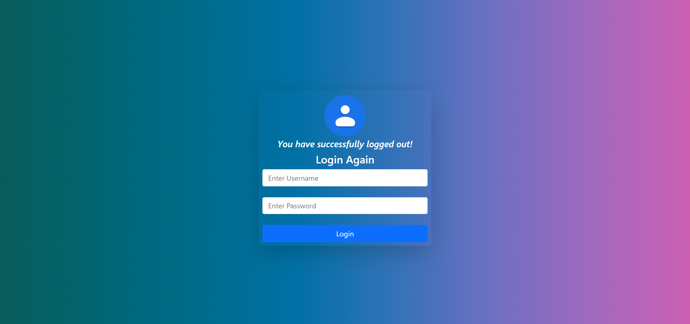

<h1 align='center'>GROCERY RECORD MANAGEMENT SYSTEM 🛒</h1>
<h4 align='center'>This project is based on CRUD operations where you can ADD,UPDATE,DELETE the grocery records.</h4>
<h2>Screenshots📷</h2>

<h2>Technology Stack 🛠️</h2>

&nbsp &nbsp
&nbsp &nbsp
&nbsp &nbsp
&nbsp &nbsp
&nbsp &nbsp
&nbsp 

<h2>Sharing 💗</h2>

Project is open source. Feel free to make your own version.All you need to do is to fork this repository. Mark star ⭐ if you like the project.

<h2>Getting Started ✔️</h2>
<ol>
<li>To Get Started, Fork this repository to your GitHub account:
<li>Clone the forked repo from your account using:
</ol>
<pre>
<code>
    git clone https://github.com/&ltyour-username&gt/grocery_management_system.git
</code>
</pre>

<h2>Setting up Database 💾</h2>
<li>Download XAMPP software -----> <a href="https://www.apachefriends.org/index.html">XAMPP-download</a> <----- Download according to your system OS.
<li>After installation open XAMPP and start the SQL server.
<li>Open <a href="model.py">model.py file.</a>
<li>Copy the sql query which is written in the comment section.
<li>First copy the create database query and execute it in command prompt or MySQL workbench.
<li>After executing create database query execute the create table query.

<h2>How to run 🤔 </h2>
<li>Open the cloned repository in Visual Studio Code.
<li>You need to activate the virtual environment.
<li>Open Terminal-----> New Terminal.
<li>Type <b>venv\Scripts\activate </b>and hit enter.
<li>For more info about virtual environment visit <a href=https://flask.palletsprojects.com/en/2.0.x/installation/">Flask-Environment</a>
<li>After activating the environment type <b>python .\app.py</b> and hit enter
<li>After execting the above command you should see the below message 👇

* Environment: production

 * Debug mode: on

 * Debugger is active!

* Running on http://127.0.0.1:5000/ (Press CTRL+C to quit)

<li>Click on the above URL to load the app.
<li>After loading the URL you will be redirected to a WELCOME Page.
<li>Click on Login to Continue.

<h2>Login Details 🔒</h2>
<li>Username : admin
<li>Password : admin

Congrats! You have successfully executed the project. Now you can ADD,UPDATE,DELETE the grocery records.

<h2>Virtual Environment Issue ❌</h2>
<li>Incase if your virtual environment doesn't get activated.
<li>You need to manually select the interpreter.
<li>Click on the bottom left of the vs code.
<li>Select and click on the venv interpreter.
<li>This will solve your virtual environment issue.

<h2>NOTE 📝</h2>
<li>Everytime before you run the project you need to start the SQL server (XAMPP).
<li>Whenever you ADD or UPDATE the grocery item you need to choose image file of the specified grocery or else your record won't be added or updated.

<h2>Having issues ❓</h2>
If you are stuck at something or have any errors/issues in the project feel free to contact me at <a href="mailto:prasadyewle199@gmail.com">prasadyewle199@gmail.com</a> :)
